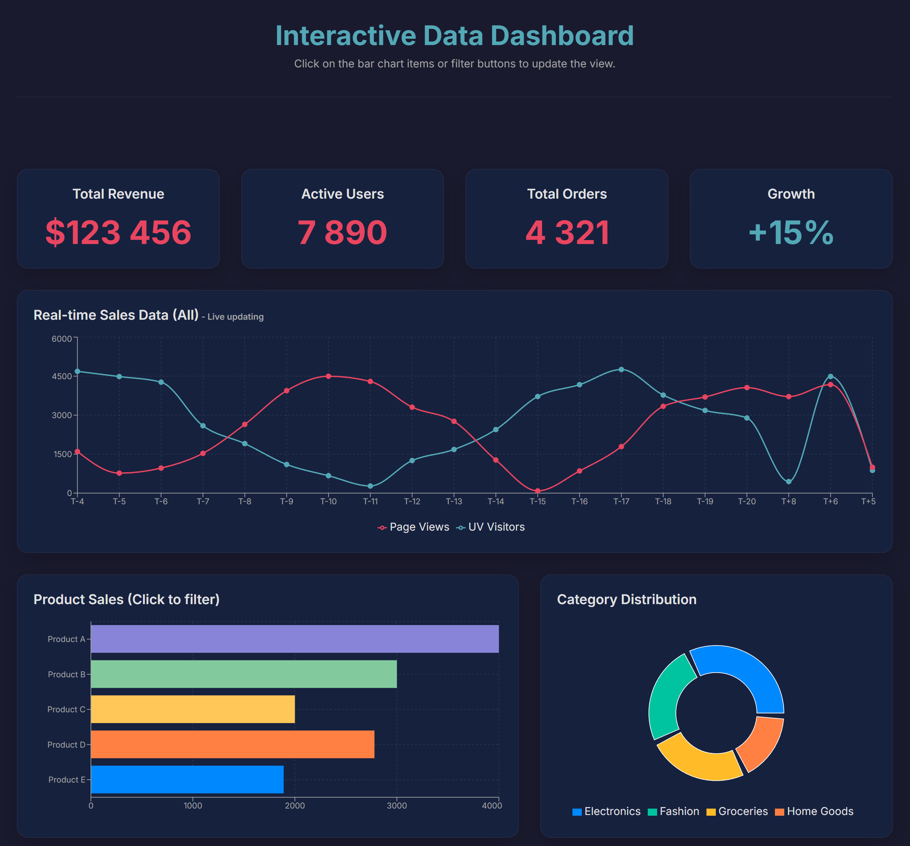

# 📊 Interactive Data Dashboard

A modern, animated data visualization dashboard built with React, TypeScript, Framer Motion, and Recharts.



## ✨ Features

- **Real-time Data Updates** — Live updating line charts with simulated data streams
- **Interactive Charts** — Click on bar charts to filter all visualizations simultaneously
- **Smooth Animations** — Fluid 60fps animations powered by Framer Motion
- **Animated Counters** — Numbers animate smoothly when data changes
- **Responsive Design** — Works seamlessly on desktop, tablet, and mobile devices
- **Dark Theme** — Modern dark UI with carefully selected color palette
- **TypeScript** — Full type safety throughout the codebase
- **Loading States** — Skeleton loaders for better UX during data fetching

## 🛠️ Tech Stack

| Technology | Purpose |
|------------|---------|
| [React 18](https://react.dev/) | UI Framework |
| [TypeScript](https://www.typescriptlang.org/) | Type Safety |
| [Vite](https://vitejs.dev/) | Build Tool |
| [Framer Motion](https://www.framer.com/motion/) | Animations |
| [Recharts](https://recharts.org/) | Data Visualization |

## 📦 Installation

### Prerequisites

- Node.js 18.x or higher
- npm 9.x or higher (or yarn/pnpm)

### Setup

1. **Clone the repository**

   ```bash
   git clone https://github.com/yourusername/interactive-dashboard.git
   cd interactive-dashboard
   ```

2. **Install dependencies**

   ```bash
   npm install
   ```

3. **Start development server**

   ```bash
   npm run dev
   ```

4. **Open in browser**

   Navigate to [http://localhost:5173](http://localhost:5173)

## 🚀 Available Scripts

| Command | Description |
|---------|-------------|
| `npm run dev` | Start development server with hot reload |
| `npm run build` | Build for production |
| `npm run preview` | Preview production build locally |
| `npm run lint` | Run ESLint for code quality |
| `npm run lint:fix` | Fix auto-fixable lint issues |
| `npm run type-check` | Run TypeScript compiler check |
| `npm run test` | Run test suite |
| `npm run test:coverage` | Run tests with coverage report |

## 📁 Project Structure

```text
src/
├── App.tsx                    # Application entry point
├── index.css                  # Global styles and CSS variables
├── main.tsx                   # React DOM render
│
├── types/
│   └── dashboard.types.ts     # TypeScript interfaces and types
│
├── constants/
│   └── dashboard.constants.ts # Theme colors, animation config, etc.
│
├── hooks/
│   ├── useAnimatedCounter.ts  # Animated number counter hook
│   └── useDashboardData.ts    # Dashboard state management hook
│
├── utils/
│   └── dataGenerators.ts      # Data generation utilities
│
├── data/
│   └── mockData.ts            # Mock data for charts
│
└── components/
    ├── Dashboard.tsx          # Main dashboard component
    ├── DashboardHeader.tsx    # Header with title
    ├── StatsGrid.tsx          # Statistics cards grid
    ├── StatCard.tsx           # Individual stat card
    │
    ├── ui/
    │   ├── Card.tsx           # Reusable card component
    │   ├── CardSkeleton.tsx   # Loading skeleton
    │   ├── FilterButton.tsx   # Animated filter button
    │   └── AnimatedCounter.tsx # Animated number display
    │
    └── charts/
        ├── CustomTooltip.tsx   # Shared chart tooltip
        ├── SalesLineChart.tsx  # Time series line chart
        ├── ProductBarChart.tsx # Product sales bar chart
        └── CategoryPieChart.tsx # Category distribution pie chart
```

## 🎨 Customization

### Theme Colors

Edit CSS variables in `src/index.css`:

```css
:root {
  --bg-color: #1a1a2e;
  --card-bg-color: #16213e;
  --primary-color: #0f3460;
  --secondary-color: #e94560;
  --accent-color: #53a8b6;
  --text-color: #e0e0e0;
  --text-muted-color: #a4a4a4;
  --border-color: rgba(224, 224, 224, 0.1);
}
```

### Animation Settings

Modify animation parameters in `src/constants/dashboard.constants.ts`:

```typescript
export const ANIMATION_CONFIG = {
  spring: {
    damping: 40,
    stiffness: 300,
  },
  chart: {
    duration: 300,
  },
  pie: {
    duration: 800,
  },
  stagger: 0.1,
} as const;
```

### Adding New Stat Cards

Add configuration to `STAT_CARDS_CONFIG` in constants:

```typescript
export const STAT_CARDS_CONFIG: StatCardConfig[] = [
  // ... existing cards
  {
    id: 'newMetric',
    title: 'New Metric',
    getValue: (stats) => stats.newMetric,
    prefix: '',
    suffix: ' units',
  },
];
```

## 🔌 API Integration

To connect to a real API, modify the `useDashboardData` hook:

```typescript
// src/hooks/useDashboardData.ts

useEffect(() => {
  const fetchData = async () => {
    try {
      const response = await fetch('/api/dashboard');
      const apiData = await response.json();
      setData(apiData);
    } catch (error) {
      console.error('Failed to fetch dashboard data:', error);
    } finally {
      setLoading(false);
    }
  };

  fetchData();
}, []);
```

## 📱 Responsive Breakpoints

| Breakpoint | Description |
|------------|-------------|
| `> 1200px` | Full desktop layout (3-column charts) |
| `768px - 1200px` | Tablet layout (stacked charts) |
| `< 768px` | Mobile layout (compact spacing) |

## 🧪 Testing

```bash
# Run all tests
npm run test

# Run tests in watch mode
npm run test:watch

# Generate coverage report
npm run test:coverage
```

## 📄 License

This project is licensed under the MIT License — see the [LICENSE](LICENSE) file for details.

## 🤝 Contributing

Contributions are welcome! Please read our [Contributing Guide](CONTRIBUTING.md) for details.

1. Fork the repository
2. Create your feature branch (`git checkout -b feature/amazing-feature`)
3. Commit your changes (`git commit -m 'Add some amazing feature'`)
4. Push to the branch (`git push origin feature/amazing-feature`)
5. Open a Pull Request

## 📧 Contact

- **Author**: Your Name
- **Email**: your.email@example.com
- **GitHub**: [@yourusername](https://github.com/yourusername)

## 🙏 Acknowledgments

- [Recharts](https://recharts.org/) for the excellent charting library
- [Framer Motion](https://www.framer.com/motion/) for smooth animations
- [Inter Font](https://rsms.me/inter/) for beautiful typography

---

<p align="center">
  Made with ❤️ and React
</p>
```